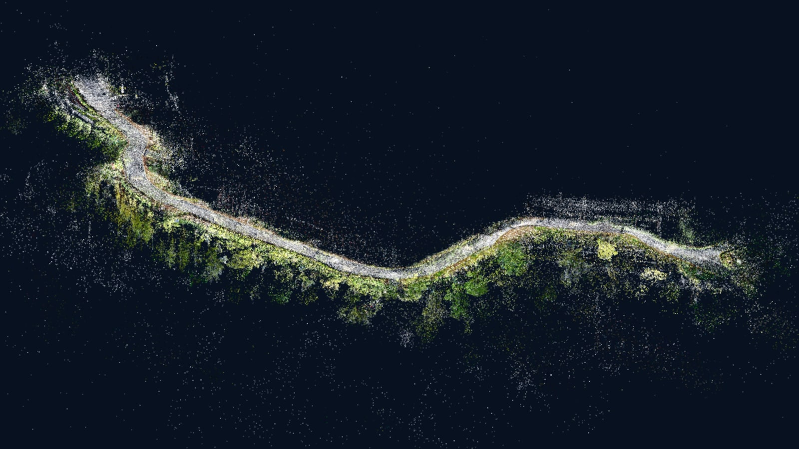
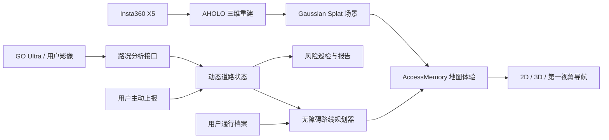

# AccessMemory 路忆

> 基于真实空间重建、动态路况理解和个性化约束的 AI 无障碍三维地图。

AccessMemory 面向轮椅使用者、低视力与全盲用户，以及其他行动不便人群。产品使用 Insta360 X5 采集园区空间，经 AHOLO 生成 Gaussian Splatting 三维场景，并将无障碍设施、道路状态、个性化路线和第一视角导航组织在同一套地图体验中。

本仓库为 **Insta360 黑客松公益赛道 Demo**。当前版本聚焦一条可完整演示的闭环：

```text
真实空间预览 -> 个性化路线规划 -> 第一视角导航
              -> 发现道路障碍 -> 更新路况 -> 自动重新规划
```



## 产品亮点

| 能力 | 说明 | 当前状态 |
| --- | --- | --- |
| 四个独立三维场景 | 入口园区、酒店连廊、酒店内庭、湖畔园林，不对模型做强行拼接 | 已实现 |
| 无障碍路线规划 | 基于道路状态、台阶、坡道、宽度和用户偏好计算可达路线 | 已实现 |
| 第一视角导航 | 从路线起点进入，沿规划节点连续行走，并支持键鼠探索 | 已实现 |
| 多人群通行档案 | 轮椅、低视力、全盲三类路线权重与提示策略 | 已实现 |
| 2D / 3D 双视图 | 三维实景与二维拓扑路网共享地点、路线和路况数据 | 已实现 |
| 动态路况闭环 | 影像分析后更新道路状态，并触发路线自动改道 | 已实现 |
| 社区上报与巡检 | 上报道路状态、查看风险清单并导出巡检摘要 | 已实现，数据仅保存在当前会话 |
| 关怀与语音模式 | 大字高对比界面、状态文字标识和 Web Speech 播报 | 已实现 |

完整范围和验收标准见 [AccessMemory_MVP_SPEC.md](./AccessMemory_MVP_SPEC.md)。

## 系统架构



影像分析通过统一的 `analyzeRoadMedia(file, profile, context, onProgress)` 接口接入业务层，将识别进度与道路风险结果同步到地图、路线和巡检模块。

## 技术栈

- **产品展示页**：React 19、TypeScript、Vite 6、Framer Motion、Lucide React
- **三维地图**：Three.js、定制版 `gaussian-splats-3d`、原生 JavaScript
- **路线规划**：带无障碍约束和道路状态权重的 Dijkstra
- **三维数据**：Insta360 X5 采集、AHOLO 重建、`.splat` Web 渲染
- **语音能力**：浏览器 Web Speech API
- **大文件管理**：Git LFS

## 仓库结构

```text
.
├── README.md                          # 项目说明与运行指南
├── AccessMemory_MVP_SPEC.md           # MVP 产品需求与验收标准
├── *.splat                            # 四个栖霞 Demo 场景，使用 Git LFS
├── cloud-nanjing-university-tour/     # React 产品展示页
└── gs_campus/                         # 3D 引擎与 AccessMemory 产品页
    └── demo/
        ├── accessmemory.html          # 3D 产品页面
        ├── accessmemory.css           # 产品视觉与响应式样式
        └── js/accessmemory/
            ├── app.js                 # 状态管理和业务交互
            ├── data.js                # 场景、地点、道路和风险数据
            ├── route-planner.js       # 无障碍路线规划
            ├── road-analyzer.js       # 可替换的影像分析接口
            ├── first-person-explorer.js
            ├── sky-environment.js
            └── scene-overlay.js
```

`gs_campus/` 前身为“小蓝鲸”南大 3D 校园地图，本项目复用了其 Gaussian Splatting 渲染与基础相机能力；`cloud-nanjing-university-tour/` 前身为校园导览展示页，现已改造为 AccessMemory 产品展示页。

## 快速开始

### 环境要求

- Git 2.30+
- Git LFS 3+
- Node.js 18+
- Python 3.10+，仅用于启动根目录静态服务器
- 支持 WebGL 2 的现代桌面浏览器，推荐 Chrome 或 Edge

### 1. 获取大文件

```bash
git lfs install
git clone https://github.com/Dabingzz/access-memory.git
cd access-memory
git lfs pull
```

确认仓库根目录存在以下四个场景文件：

```text
1现代建筑园区入口与景观步道.splat
2新中式酒店走廊(1).splat
3.splat
4湖畔度假区入口与园林.splat
```

### 2. 启动 3D 地图

场景页面需要同时访问 `gs_campus/` 和仓库根目录的 `.splat` 文件，因此必须从仓库根目录启动静态服务器：

```bash
python -m http.server 8080 --bind 127.0.0.1
```

打开：

```text
http://127.0.0.1:8080/gs_campus/demo/accessmemory.html
```

可通过查询参数直接打开指定场景：

```text
?scene=entrance
?scene=corridor
?scene=courtyard
?scene=lakeside
```

### 3. 启动产品展示页

另开终端：

```bash
cd cloud-nanjing-university-tour
npm install
npm run dev
```

展示页默认地址为 `http://127.0.0.1:3000`。其中“打开 3D 空间”会访问 `http://127.0.0.1:8080`，因此演示完整链路时需同时运行两个服务。

## 推荐演示流程

1. 从展示页进入入口园区，说明 X5 采集与 AHOLO 实景重建流程。
2. 切换四个独立场景，并使用数字键 `1` 至 `4` 定位无障碍设施和风险点。
3. 选择轮椅、低视力或全盲档案，修改路线偏好并规划路线。
4. 点击“开始导航”，从起点进入第一视角，使用“下一节点”逐段行走。
5. 打开“影像分析”，演示检测障碍、道路转为阻断和路线自动改道。
6. 查看附近可达设施、风险巡检和社区上报，再切换 2D 路网与关怀模式。

## 交互说明

| 操作 | 功能 |
| --- | --- |
| `W` / `S` | 第一视角沿道路前进 / 后退 |
| `A` / `D` | 第一视角在道路范围内横向微调 |
| `Shift` | 加速移动 |
| 鼠标移动 | 第一视角环视 |
| `Esc` | 退出鼠标锁定，选择页面控件或地点标志 |
| `1` - `4` | 平滑前往当前场景的快速观察点 |
| `M` | 进入或退出支持自由探索的第一视角道路 |
| `R` | 返回场景总览 |

入口园区和湖畔园林支持自由第一视角探索；所有场景均可通过“开始导航”进入规划路线的引导式第一视角。

## 道路状态

| 状态 | 含义 | 路由行为 |
| --- | --- | --- |
| `OPEN` | 已核验可通行 | 正常参与规划 |
| `CAUTION` | 可通行但存在风险 | 增加路线成本并提示用户 |
| `BLOCKED` | 当前无法通行 | 从可用路线中排除 |
| `UNKNOWN` | 信息不足或待复核 | 谨慎参与规划并明确标记 |

## 开发与验证

展示页构建：

```bash
npm --prefix cloud-nanjing-university-tour run build
```

业务模块语法检查：

```bash
node --check gs_campus/demo/js/accessmemory/app.js
node --check gs_campus/demo/js/accessmemory/data.js
node --check gs_campus/demo/js/accessmemory/route-planner.js
node --check gs_campus/demo/js/accessmemory/first-person-explorer.js
node --check gs_campus/demo/js/accessmemory/scene-overlay.js
node --check gs_campus/demo/js/accessmemory/sky-environment.js
```

## 当前限制

- 用户上报、道路更新和风险数据仅保存在当前浏览器会话，刷新后恢复初始状态。
- Demo 不包含账号、权限、云端数据库、实时定位或跨设备同步。
- 三维模型体积较大，首次加载时间取决于本地磁盘、网络和 GPU 能力。
- 场景地点和设施为比赛演示数据，不能直接作为真实出行安全承诺。

## 版本管理

- `main`：可演示的稳定基线。
- `feat/*`：功能开发分支。
- 提交信息遵循 Conventional Commits。
- `.splat`、`.ply`、`.glb`、音视频等大文件统一由 Git LFS 管理。
- `node_modules/`、构建产物、环境变量和 IDE 配置不进入版本库。

## 数据与隐私

当前 Demo 的媒体选择与分析流程在浏览器端完成，不会将媒体上传到远程服务。接入云端影像分析服务前，必须补充用户授权、隐私说明、数据最小化、保留周期和删除机制。

## 许可与来源

- `gs_campus/` 中的上游 Gaussian Splatting 引擎遵循其目录内的 [MIT License](./gs_campus/LICENSE)。
- 仓库根目录目前未声明统一的开源许可证；除上游已授权部分外，项目代码、场景模型和媒体素材默认保留权利。
- Demo 场景由项目团队使用 Insta360 设备采集并用于比赛展示。
